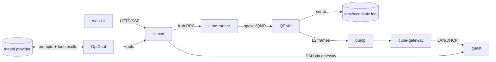

# System review, 2026-10-07 (show-me format)

Reviewed: `origin/main` at 2204d7c1 (after #108), plus the urgent fix in #109.
Method: read-only code reading, unit/integration tests with the fake QEMU,
throwaway reproductions under `/tmp`. No VM launched, no runner or cubed
contacted, no live log read, no key retrieved. Format follows HumanLayer's
[show-me](https://www.humanlayer.com/blog/show-me-skill) (diagrams, call stacks,
file maps and diffs instead of prose).

Evidence labels used throughout:

| label | meaning |
|---|---|
| **REPRODUCED** | a test or script in this review shows it |
| **OBSERVED** | read in the code at the cited line; not executed |
| **INFERRED** | plausible from the code, not shown; needs real evidence |

Gaps: nothing here was run against a real model, a real runner (Linux or
macOS), a real guest, or a real browser. The browser suite was skipped locally
(no Chromium). The incident's raw output was not read.

---

## 1. Map

```
packages/
├── server/src/            # cubed: product API, activation, OptChat
│   ├── index.ts           # HTTP routes, recovery loop, wiring
│   ├── vm.ts              # ThreadVms: boot, waitReady, re-attach, diagnose
│   ├── vm-seed.ts         # cloud-init seed (host key private half lives here)
│   ├── vm-diagnostics.ts  # bundle, clean/redact (mirror of diagnose.rs), OptChat text
│   ├── guest-ssh.ts       # tools over SSH to the guest helper, pinned host key
│   ├── durable-agent.ts   # Pi AgentHarness + SQLite
│   ├── optchat.ts         # OptChat agent, tools (spawn, tell, diagnose, ...)
│   ├── optchat-wishes.ts  # wish finder prompt, parse, apply
│   └── usage*.ts          # token/cost accounting
├── node-transport/src/    # cube-runner
│   ├── runner.rs          # VM lifecycle, vm.inspect, vm.diagnose
│   ├── diagnose.rs        # excerpts, events.log, clean/redact
│   └── pump.rs            # L2 frames QEMU <-> gateway
├── gateway/               # cube-gateway: LAN, DHCP, egress, TLS interception
└── web/                   # Svelte 5 UI (ChatThreads.svelte: overview + wishes)
```



---

## 2. Security incident: guest SSH host keys in OptChat

### Where the key lives (OBSERVED)

```
generateKeys            vm.ts:972   ssh-keygen, no passphrase -> <thread dir>/host_ed25519
vmSeed                  vm-seed.ts:112  ssh_keys.ed25519_private -> cloud-init user-data
Runner.start            runner.rs   seed.img (CIDATA) in vms/<n>/, fixed at first start
guest                   /etc/ssh/ssh_host_ed25519_key (root; the agent has sudo)
```

### How console text reached the chat (OBSERVED)

```
OptChat tool "diagnose"                    optchat.ts:1267
  threads.diagnose(id)                     index.ts:279
    threadDiagnostics                      vm-diagnostics.ts:148
      ThreadVms.diagnose                   vm.ts (runnerPart)
        runner vm.diagnose                 runner.rs:diagnose
          log_excerpt(console, 8K head + 56K tail)  diagnose.rs:read_window
          clean_value -> safe_text -> redact        <- leak 1
        | old runner: vm.inspect consoleTail (16 KiB, RAW)   <- leak 2
      clean(bundle) -> redact                                  <- same flaw as leak 1
    formatDiagnostics: last 40 console lines -> tool result -> model provider + transcript
ThreadVms.waitReady "stopped while booting": last 3 RAW console lines   vm.ts:785 (before #109)
  -> workspaceError, logs, UI, OptChat thread summaries (as a user-role message)
```

### Root cause in the redactor (REPRODUCED on synthetic input)

Old logic, both `diagnose.rs::redact` and `vm-diagnostics.ts::redact`:

```
if first "-----END " in text has no "-----BEGIN " anywhere before it:
    redact from text start to that END        # only case for a cut-off BEGIN
for each "-----BEGIN ... PRIVATE KEY-----": redact to its END
```

An excerpt is `head + "[... N bytes omitted ...]" + tail`. When the tail
starts inside a key and *any* BEGIN line came earlier (cloud-init's
`-----BEGIN SSH HOST KEY FINGERPRINTS-----`, a certificate, a whole earlier
key), the key body passed through. The new tests fail on the old code with
`SyntheticKeyBody leaked`.

Which exact form the incident's console had is **not verified** (the raw output
was deliberately not read). Note for whoever triages: cloud-init also prints
`-----BEGIN SSH HOST KEY KEYS-----` blocks, which hold *public* keys only. The
user confirmed private material, so the keys are treated as compromised either
way.

### Fix in #109 (merged only when CI is green)

```diff
 redact(text)
-  one leading orphan END, then BEGIN..END pairs
+  markers = every BEGIN|END ... PRIVATE KEY (any armor, any case, PGP BLOCK)
+  BEGIN  -> redact to the next END, or to the end of text
+  END without BEGIN -> redact from text start, or from after "[... omitted ...]"
+  then: base64 runs >= 60 chars (mixed case + digits), their continuation
+        lines, and the OpenSSH magic -> redacted (key cut at both ends)
+        public keys after "ssh-*"/"ecdsa-*", hex digests, fingerprints stay
 runner vm.inspect:     console tail now clean()ed            runner.rs:inspect
 runner qemu exit msg:  log tail now clean()ed                runner.rs (reaper)
 cubed waitReady error: clean(consoleTail), last 3 lines, 512 chars  vm.ts:785
 guest-ssh error:       clean(helper stderr), last 2 lines, 512 chars guest-ssh.ts:81
```

An independent review (Fable) asked for changes in round 1. All of them were
fixed in 372f6914, each with a test:

- **cubed's key-body pass was O(n²).** A 256 KiB console blocked the event
  loop for about 58 s, and a hostile input for 187 s. It now runs in 61–85 ms.
- **A BEGIN whose END fell in the omitted middle swallowed the whole tail.**
  Redaction now stops at the omission marker.
- **A key's short last line leaked** after timestamp or cloud-init prefixes or
  after an escaped lone CR.
- **The Rust walk-back was quadratic.**
- **Later short lines were over-redacted.**
- **Raw guest stderr went into `GuestTransportError`.**

Tests: `diagnose.rs` (`keys_cut_or_escaped_are_redacted`,
`excerpt_cut_inside_a_key_is_redacted`), `runner_diagnose.rs` (a real file
through `vm.diagnose` and `vm.inspect` over the Iroh wire), and
`vm-diagnostics-test.ts` (mirror cases plus the old-runner `vm.inspect` path).

The cubed half protects OptChat and `GET /api/threads/<id>/diagnostics` as
soon as cubed is updated, **whatever the runner version**, because cubed
re-cleans everything the runner sends. The runner half needs a runner release.

Limit, stated in docs: a guest is root in its own machine and can print its key
encoded. Redaction catches accidents. It is not a boundary.

### Containment and rotation (needs operator approval; none done)

| # | action | why |
|---|---|---|
| 1 | Deploy a cubed that includes #109 before anyone runs `diagnose` again | stops the chat path for old and new runners alike |
| 2 | Treat the host keys of threads 0f4ab4a6 (Mac) and 73fe9c5a (Linux) as compromised | they were sent to the model provider as tool output and stored in OptChat's transcript |
| 3 | Find and scrub the copies: OptChat session store and transcript for those tool results; any cubed journal lines that carry tool results (INFERRED: not verified that tool results are logged) | the bytes persist after the fix |
| 4 | Rotate: no in-place rotation exists. The runner fixes the seed at first start and cloud-init applies `ssh_keys` once per instance id. The options are (a) discard and re-provision those machines (the workspace is kept per the retained-disk rules), or (b) add a helper operation `cube-guest rotate-host-key` plus a `known_hosts` update in cubed | the key pins the guest's identity to cubed |
| 5 | Assess the exposure: using the key means intercepting cubed→guest SSH, which runs over the gateway LAN inside the runner/cubed path (INFERRED: low exploitability). Any party with transcript access holds it | sets the urgency for #4 |
| 6 | Release the runner with #109 | `vm.inspect` raw tails and the bounded excerpts at the source |

---

## 3. Thread machine start (from code; timings are code constants)

```mermaid
sequenceDiagram
  participant C as cubed vm.ts
  participant R as runner.rs
  participant Q as QEMU
  participant G as gateway
  participant V as guest
  C->>R: vmInspect, then vmStart(epoch, frameToken)  (vm.ts:488)
  R->>Q: spawn, record_launch; wait_for_qmp up to 3 s (START_WAIT)
  R-->>C: starting|running; QMP_READY 60 s, then kill
  C->>G: gateway.attach (vm.ts:494), only after vmStart answers
  G->>R: link dial (15 s connect, 0.5–10 s backoff)
  Note over Q,V: firmware → GRUB → kernel → cloud-init (guest frames dropped until the link is up)
  V->>G: DHCP
  loop waitReady (vm.ts:756), 2 s delay, vmInspect every 15 s
    C->>V: ssh hello (dial timeout 10 s)
  end
  V-->>C: ready = boot-finished + initialized + git/gh/curl
```

### Mac ~40 s vs Linux ~10 s, QEMU to ready (unexplained; not conflated)

The current 0f4ab4a6 boot is healthy but slow. Candidates, none proven:

| candidate | label | how to tell from existing evidence |
|---|---|---|
| link attaches after vmStart answers; early DHCP frames dropped → guest DHCP backoff (1,2,4,8,16 s) | INFERRED | runner event "gateway connected" vs "first frame from the guest" vs the dropped-frame count (`frames`) |
| hello poll granularity ~12 s before a lease (10 s dial + 2 s delay) | OBSERVED (code) | cubed "guest not ready" events |
| EDK2 `-bios` with no varstore (vm.rs:137): boot entries rebuilt each boot, possible fallback reset | INFERRED | repeated firmware banners / `fallback:` in the console |
| GRUB timeout on arm64 EFI | INFERRED | console |
| per-boot package retry sleeps 10–60 s if git/gh/curl missing | OBSERVED (code) | only if packages are missing; the guest journal |

The historical d63a21db HVF/firmware stall (recovered by a same-disk QMP
restart) is a **separate** event with unknown cause. Evidence missing for next
time (OBSERVED): no timestamps on console lines; `launch.json` replaced on every
start (runner.rs:1223); only one `console.prev.log` (overwritten); one CPU
sample, so a spinning vCPU can't be told from an idle one; no firmware hash;
no record of which recovery was used.

---

## 4. Findings

### OptChat wishes (known defects, all confirmed)

| # | defect | label | where | minimal fix |
|---|---|---|---|---|
| W1 | "save for later" classified *deferred*, then refused | OBSERVED | prompt `optchat-wishes.ts:138`, refusal `:214`; test pins it `test/optchat-wishes-test.ts:70,80` | add kind `saved` ("keep/save/remember for later") and accept it alongside `wish` |
| W2 | failed or mismatched spawn marks wish started | REPRODUCED (subagent `/tmp` script) | `handOffResult` takes the first echo within 4 messages `:74-77`; `entryMessages` drops `toolCallId` `optchat.ts:304,311`; the spawn regex matches *any* started line `:81` | match results by tool call id; for a multi-task spawn, check that task's own result line |
| W3 | open wishes panel never refreshes after delayed extraction | OBSERVED | `ChatThreads.svelte:116` interval calls only `load()`; the finder runs ≥3 min after quiet (`optchat.ts:46`) | track `wishesOpen`; poll `loadWishes` while open and "catching up"; in-flight guard |
| W4 | truncated reply (`stopReason: "length"`) lost; next chunk waits 15 min | REPRODUCED (lost) / OBSERVED (stall) | `replyText` `:267` treats length as success; parse fails → `WishAnswerError` → `through` skips the chunk (`optchat.ts` ~1109); `doc.error` makes the spacing `wishRetryMs` (~1084) | throw a truncation error; retry the same `from` with half the chunk; keep the 15 min spacing for provider errors only |

Accounting of wish-finder calls is correct (counted before parsing, source
`optchat-wishes`). OBSERVED.

### Lifecycle and runner

| # | finding | sev | label | where | minimal fix |
|---|---|---|---|---|---|
| L1 | `Pumps::close` relies on Drop while `serve_inner` holds its own `Arc`: the gateway link stays up after stop/exit | med | OBSERVED | `pump.rs:177`, `:292-305` | clear `current` and abort the reader in `close` |
| L2 | `booted` is taken from the state *before* vmStart; a QEMU that died in between gets the 2 min re-attach wait and skips resume hooks | med | OBSERVED | `vm.ts:478`, `:499` | derive it from `startedAt` in the vmStart answer |
| L3 | a hung guest under a live QEMU is re-attached forever, never power-cycled | med | OBSERVED | recovery loop `index.ts:598-613`, re-attach `vm.ts` | after a failed re-attach with zero guest frames, stop+start once and record it |
| L4 | stop while QMP isn't up still waits the full 30 s grace | low | OBSERVED | `runner.rs` stop_vm | skip the grace when power-down couldn't be sent |
| L5 | `discard` takes no `ops` lock | low | OBSERVED | `runner.rs` discard | take `ops` as `release` does |
| L6 | the late-QMP kill (f312f9c4) and epoch fencing in #102 are correct | — | OBSERVED | `runner.rs` kill_pid | none |

### Guest text, logs, prompt injection

| # | finding | sev | label | where | minimal fix |
|---|---|---|---|---|---|
| S1 | raw console in "stopped while booting" reached `workspaceError`, logs, UI and OptChat | high | OBSERVED | `vm.ts:785` | **fixed in #109** |
| S2 | thread errors and reports reach OptChat's model as user-role messages: guest-controlled text in a tool-bearing model's input | med | OBSERVED | `optchat-threads.ts:120,130,161`, `optchat.ts:953` | send as marked untrusted notices, not user turns |
| S3 | `log.ts` doesn't redact; every `error` field is logged verbatim | low | OBSERVED | `log.ts` formatLine | apply `redact` to string/Error values |
| S4 | template seal output (200 chars) copied raw into an error | low | OBSERVED | `vm.ts:656` | `clean()` |
| S5 | guest helper stderr copied raw into `GuestTransportError` (→ workspaceError, OptChat) | low | OBSERVED | `guest-ssh.ts:81` | **fixed in #109** |

### Frontend, tools, cost, CI

| # | finding | sev | label | where |
|---|---|---|---|---|
| F1 | Pi watch frames queued in order (up to 100) rather than latest-wins, contrary to the comment | med | OBSERVED | `pi-thread-events.ts:36` vs `thread-events-http.ts:29` |
| F2 | the whole transcript is re-sent and markdown re-parsed per frame; cost grows with the square of the run length | med | OBSERVED / cost INFERRED | `thread-events-http.ts:21`, `Conversation.svelte:346,358` |
| F3 | Claude events: the first frame is sent before subscribing; a failed delivery is swallowed | low | OBSERVED | `claude-thread-events.ts:33-37` |
| T1 | guest command output keeps the head only; errors at the end of long output are lost | med | OBSERVED | `cube-guest.py:1236-1238` |
| T2 | the mod's Read caps lines, not bytes (a minified one-line file goes in whole) | med | OBSERVED | `claude-mod/hooks/tools.ts:126-131` |
| T3 | a transport failure mid-command leaves the guest command running, so the model may start it twice | med | OBSERVED | `tools.ts:115`, `durable-agent.ts:164` |
| C1 | Claude Code resume usage can undercount (self-documented); aborted Pi compaction not counted; usage commit errors swallowed | low | OBSERVED | `usage.ts:224-238`, `optchat.ts:701,1128` |
| Q1 | CI runs no real VM (no KVM image) and no macOS VM; claude-mod isn't typechecked; no Svelte component tests | — | OBSERVED | `.github/workflows`, `tsconfig.json` |
| Q2 | On #109's first push, all three `runner_diagnose` tests failed on macOS CI with `OUTCOME_UNKNOWN` at their first RPCs (~5 s). Two of them are untouched by the change, and the same tests pass on Linux CI and locally. Possibly a flaky macOS CI environment (INFERRED); recheck if it recurs | — | OBSERVED | CI run 37669489072 |

---

## 5. Roadmap (smallest first; each is one PR)

```
P0  security          #109 redaction (this review)           → merge, deploy cubed, release runner
P0  incident ops      §2 table rows 1–6                       → operator approval
P1  wishes            W4 truncation, W2 call-id matching, W1 saved kind, W3 refresh
P1  untrusted text    S2 OptChat untrusted notices; S3 log redaction; S4 seal output
P1  lifecycle         L2 booted from the start answer; L1 pump close; L3 one power-cycle
P2  evidence          keep N launch.json + console.prev; timestamped events for link/lease;
                      second CPU sample; firmware hash → explains the Mac 40 s and the HVF stall
P2  tools             T1 head+tail output; T3 cancel on transport loss; T2 byte cap
P3  frontend          F1 latest-wins; F2 diff frames / memo markdown; F3
P3  CI                macOS VM smoke behind a label; typecheck claude-mod
```

Not recommended now: rewriting the event transport, the wish pipeline or the
runner protocol. Each finding above has a local fix.

Coordination: this review is markdown only. Work artifacts (#110, in
flight) own the interactive artifact surface; this review neither builds nor
changes it, and #109 touches none of #110's or #111's files. Once #110 lands,
this document can be imported as an artifact.
